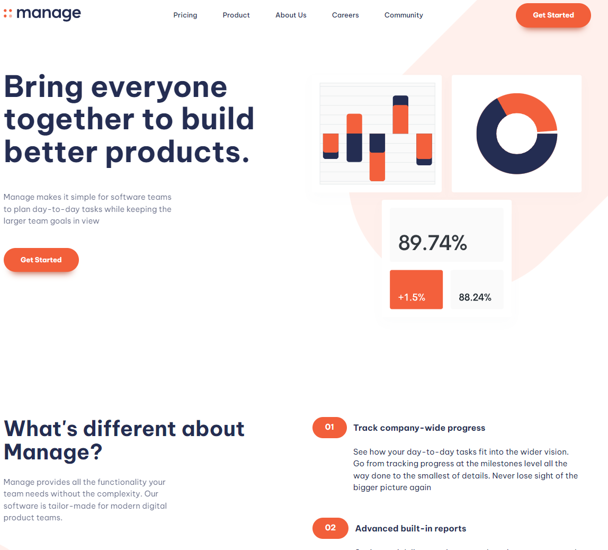
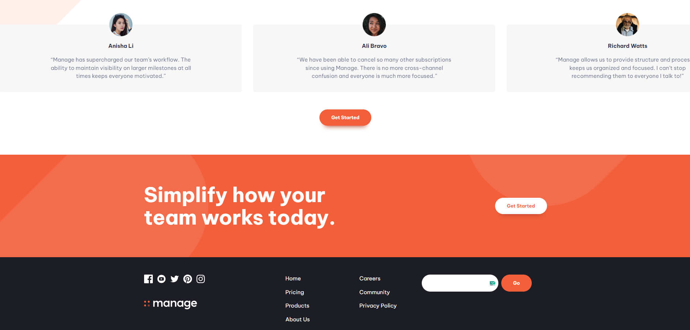
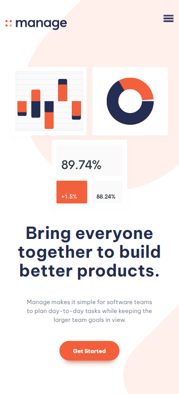

# Responsive Website Project (HTML CSS Project)
I tried to reverse the responsive website from [frontendmentor.io](https://www.frontendmentor.io/challenges/manage-landing-page-SLXqC6P5) with only HTML and CSS.

I used a template slider from [a11y](https://a11yslider.js.org/)
and Endy Bell css reset [[HERE]](https://gist.github.com/Asjas/4b0736108d56197fce0ec9068145b421).

## To do:
- fix copyright
- fix footer
- add some javascript
- 
## 🛠 Skills
Javascript, HTML, CSS, Vite
  # responsive-website-project
